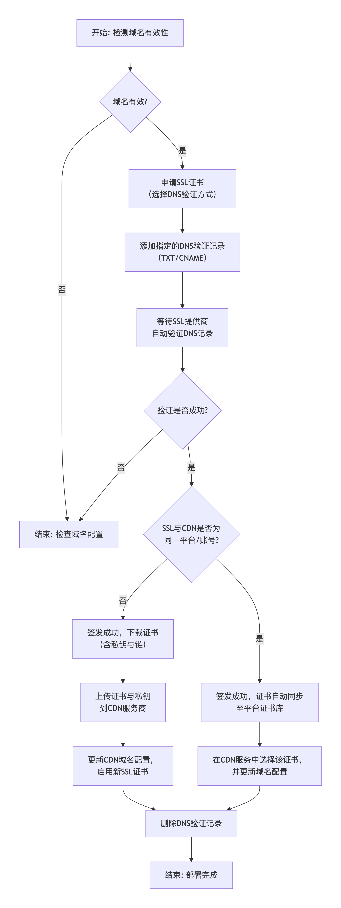
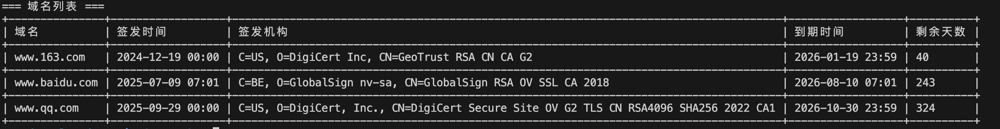

# 使用说明

一款基于 Rust 开发的CDN SSL 证书自动更新工具，支持腾讯云 cdn、ssl、dns 为同一个账号或不同账号，其他云服务商支持开发中。




## 前置条件

如果之前有 dns 验证记录,需要删除。否则后续添加不了 dns 验证记录

---

## 快速开始

1. 从 [release 页面](iKeepLearn/cdn-ssl-updater/releases) 下载可执行文件的 zip 包。
2. 解压后，修改其中的 `domains.json` 配置文件为正确的配置。

---

## 常用命令示例

- **检测域名 ssl 证书有效期**

  ```bash
  ./csu -d domains.json check
  ```

  

- **更新域名 ssl 证书**

  ```bash
  ./csu -d domains.json update
  ```

- **强制更新域名 ssl 证书**

  ```bash
  ./csu -d domains.json force-update
  ```


## 定时任务（Cron）推荐配置

- **每日凌晨 2 点自动备份数据库**

  ```bash
  0 2 * * * /path/to/csu -d /path/to/domains.json update
  ```


> 请将 `/path/to/csu` 和 `/path/to/domains.json` 替换为实际路径。

## 联系方式

如有疑问，请联系开发者。


